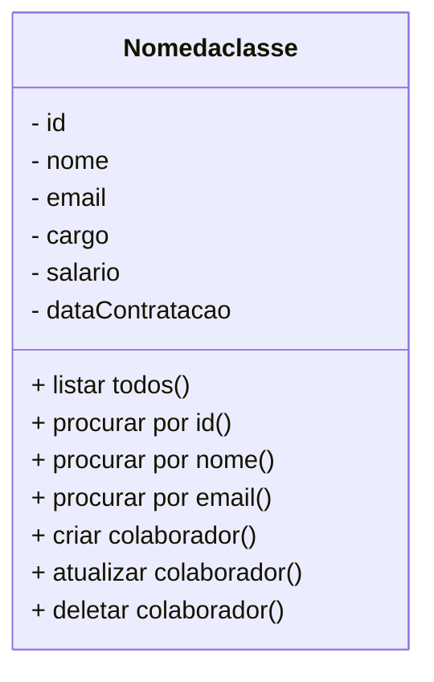

# Projeto RH

 

    

  

## 1. Descrição

É um sistema de RH feito em TypeScript com SQL Server. Ele gerencia dados de colaboradores, como nome, e-mail, cargo, salário e data admissão, ajudando a organizar e acessar informações facilmente.

------

## 2. Sobre esta API

A API desenvolvida é voltada para a gestão de funcionários, permitindo o cadastro, consulta, atualização e exclusão de dados de colaboradores de forma eficiente e segura. Construída em TypeScript, ela segue boas práticas de desenvolvimento e arquitetura, garantindo escalabilidade e facilidade de manutenção.

### 2.1. Principais Funcionalidades

1. Cadastro de Funcionários
Permite adicionar novos colaboradores ao sistema, registrando informações como nome, e-mail, cargo, salário e foto.

2. Consulta de Dados
Realiza buscas detalhadas no banco de dados com filtros por nome, cargo ou outros atributos, retornando resultados rapidamente.

3. Atualização de Registros
Oferece a possibilidade de editar informações de funcionários já cadastrados, garantindo que os dados estejam sempre atualizados.

4. Exclusão de Funcionários
Remove registros de colaboradores do sistema, mantendo o banco de dados organizado e atualizado.

------

## 3. Diagrama de Classes

------

## 4. Diagrama Entidade-Relacionamento (DER)

------

## 5. Tecnologias utilizadas

| Item                          | Descrição  |
| ----------------------------- | ---------- |
| **Servidor**                  | Node JS    |
| **Linguagem de programação**  | TypeScript |
| **Framework**                 | Nest JS    |
| **ORM**                       | TypeORM    |
| **Banco de dados Relacional** | MySQL      |

------

## 6. Configuração e Execução

1. Clone o repositório
2. Instale as dependências: `npm install`
3. Configure o banco de dados no arquivo `app.module.ts`
4. Execute a aplicação: `npm run start:dev`
